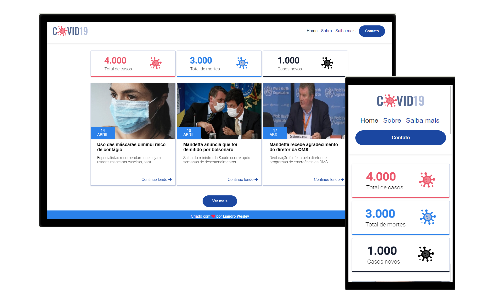

📌 Sobre o site COVID19
----

Durante o treinamento da Hiring Coders, um desafio foi proposto:

- [x] Desenvolver sem auxílio de Frameworks uma página de notícias sobre o covid-19
- [x] A página precisa ter as seis melhores notícias sobre o covid-19, sendo duas destas representadas por áudio e vídeo
- [x] A página precisa ter no menu, os seguintes links:
* Home
* Sobre
* Saiba mais
* Contato

🔧 Tecnologias utilizadas:
----
* HTML5
* CSS3
💬 Fale comigo
------------------
[*Entre em contato comigo*](https://www.linkedin.com/in/liandro-wesley)

Obrigado por chegar até aqui! Este projeto foi feito com muito ❤

